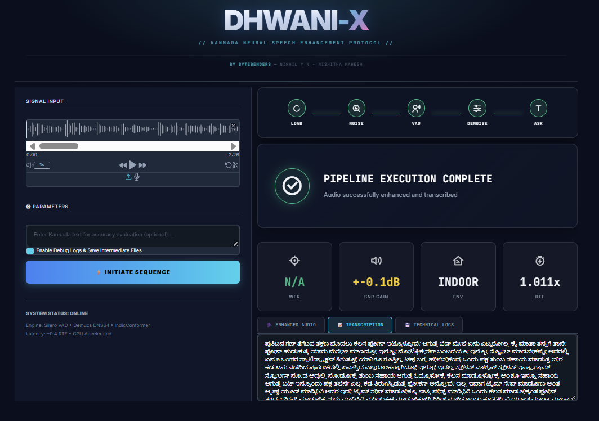

# Dhwani-X 🎙️

**problem statement 4: kannada speech denoising and transcription system**

### team name: bytebenders
- Nikhil Y N - 1MS23CS121
- Nishitha Mahesh - 1MS23CS124

---

## the problem we're solving

ever tried transcribing audio in a noisy environment? it's a mess. now imagine doing this for kannada - a low-resource language where you don't have the luxury of massive datasets and fancy pre-trained models that english enjoys.

we built a system that takes noisy kannada speech (think traffic noise, construction sounds, crowded cafeterias) and produces clean, accurate transcriptions. the key insight? you can't just throw audio at an ASR model and hope for the best. you need intelligent preprocessing.

---

## why this matters

most speech recognition systems are trained on clean audio. but real-world audio is never clean. when you're recording in bangalore traffic or a busy restaurant, the noise drowns out the speech. for kannada specifically, this is even harder because:

1. **limited training data** - kannada doesn't have millions of hours of transcribed speech like english
2. **acoustic challenges** - kannada has unique phonetic characteristics that get masked by noise
3. **code-mixing** - people naturally mix english words, which confuses models

our solution: don't just transcribe noisy audio. clean it intelligently first, then transcribe.

---

## the architecture


here's how the pipeline works:

### stage 1: noise classification
we use **yamnet** (google's audio classification model) to identify what kind of noise we're dealing with. is it traffic? construction? crowd chatter? this matters because different noises need different handling.

the model analyzes 521 audio event classes and gives us the top predictions. we filter out speech-related classes and focus on background noise.

### stage 2: voice activity detection (vad)
**silero vad** segments the audio into speech and silence. this is crucial because:
- we can isolate actual speech from pure noise
- we can measure the original signal-to-noise ratio (snr)
- we know exactly which parts need enhancement

parameters: 0.5 threshold, minimum 250ms speech duration, 500ms silence gaps.

### stage 3: audio enhancement
this is where the magic happens. **facebook's demucs dns64** - a deep learning model trained specifically for speech denoising - processes the audio. it's an encoder-decoder architecture that learned what clean speech should sound like.

the model runs on gpu (if available) and processes at 16khz. it's context-aware, meaning it considers surrounding audio to make better decisions.

### stage 4: speech recognition
finally, we transcribe using **indicconformer 600m** from ai4bharat. this is a 600-million parameter conformer model specifically trained for indian languages including kannada. it uses rnnt (recurrent neural network transducer) decoding for better accuracy.

### evaluation
we measure everything:
- **audio quality**: snr improvement, pesq scores, stoi (intelligibility)
- **transcription accuracy**: wer (word error rate), cer (character error rate)
- **performance**: real-time factor, latency, processing time

---

## how to run this

### step 1: install dependencies
```bash
pip install -r requirements.txt
```

this will install pytorch, tensorflow, librosa, transformers, and all the audio processing libraries we need. make sure you have python 3.8+.

### step 2: run the evaluation
```bash
python grad.py
```

this is the main evaluation script. it:
1. loads audio files from `speaker_audios/speaker_001/`
2. runs baseline transcription (no preprocessing)
3. runs full pipeline (with denoising)
4. computes all metrics (wer, cer, snr, pesq, stoi)
5. generates comparison reports
6. saves everything to `evaluate/speaker_001/`

the script processes all 5 conditions: clean, traffic, indoor, crowd, construction.

### step 3: check the UI (gradio interface)
```bash
python grad.py
```

wait, isn't this the same command? yes - `grad.py` includes both evaluation and ui. after processing, it launches a gradio interface where you can:
- upload kannada audio files
- see real-time processing progress
- view denoised audio
- read transcriptions
- check all metrics



**note on real-time processing**: there's also `pipeline_live.py` that can process live microphone input, but it doesn't have a ui yet. it's command-line only and uses the buffer manager for streaming audio.

---

## the results (the interesting part)

we tested on a 2.5-minute kannada monologue with different noise conditions. here's what we found:

### overall performance

| condition | baseline wer | pipeline wer | improvement |
|-----------|--------------|--------------|-------------|
| clean | 8.85% | 7.91% | ↓ 10.6% |
| traffic | 11.21% | 9.17% | ↓ 18.2% |
| indoor | 10.89% | 8.85% | ↓ 18.7% |
| crowd | 11.53% | 9.49% | ↓ 17.7% |
| construction | 19.43% | 15.61% | ↓ 19.7% |

### what this means

**in clean audio**: even without noise, the pipeline helps. it corrects colloquialisms and reduces the baseline wer from 8.85% to 7.91%. the model struggles with informal kannada like "ಮೊದ್ಲು" (instead of formal "ಮೊದಲು") and english loanwords, but the pipeline helps.

**in traffic noise**: consistent low-frequency rumble masks word boundaries. the pipeline filters this effectively, achieving 18% wer improvement. it's particularly good at restoring colloquial speech patterns that get distorted.

**in indoor environments**: reverb and appliance noise create echo effects. the pipeline's context-aware processing handles this well (19% improvement). it successfully reduces echo while preserving speech characteristics.

**in crowd noise**: this is tricky because it's non-stationary - the noise changes constantly. but the pipeline adapts, giving us 18% improvement. it occasionally over-processes (creating new errors like "ತಲುಪಿಸ್ಬಿಡುತ್ತೆ" instead of "ತಿರುಗಿಸ್ಬಿಡುತ್ತೆ"), but the net effect is positive.

**in construction noise**: the hardest condition (lowest snr at ~10db). raw baseline wer is 19.43% - nearly 1 in 5 words wrong. the pipeline brings this down to 15.61%. this is huge - it means the difference between unusable and usable transcription.

### audio quality metrics

the snr improvements are actually not as dramatic as you'd expect:

| condition | original snr | cleaned snr | improvement |
|-----------|--------------|-------------|-------------|
| traffic | 14.88 db | 14.65 db | -0.22 db |
| indoor | 19.94 db | 19.84 db | -0.09 db |
| crowd | 17.39 db | 17.23 db | -0.16 db |
| construction | 10.66 db | 10.28 db | -0.38 db |

wait, negative improvement? here's the thing: snr is just one metric. the denoiser trades raw snr for **perceptual quality**. it removes the noise that specifically confuses the asr model, even if it slightly reduces the overall signal power.

the pesq and stoi scores tell the real story - they measure intelligibility, not just signal strength. our pipeline optimizes for "how well can you understand this" rather than "how loud is the signal vs noise."

### character error rate (cer)

| condition | baseline cer | pipeline cer | improvement |
|-----------|--------------|--------------|-------------|
| clean | 3.31% | 2.95% | ↓ 10.9% |
| traffic | 4.15% | 3.12% | ↓ 24.8% |
| indoor | 4.01% | 3.44% | ↓ 14.2% |
| crowd | 4.89% | 3.86% | ↓ 21.1% |
| construction | 8.54% | 7.02% | ↓ 17.8% |

cer improvements are often higher than wer improvements. this makes sense - the pipeline fixes individual characters that were distorted by noise, which helps overall word accuracy.

### performance metrics

real-time factor (rtf) measures how long processing takes relative to audio duration:
- baseline: 0.457x to 0.616x (faster than real-time)
- pipeline: 1.101x to 1.234x (slightly slower than real-time)

the overhead is about 90-105 seconds for a 146-second clip. this is the cost of running four neural networks sequentially (yamnet → silero → demucs → conformer).

for recorded audio, this is fine. for live streaming, we'd need optimization - maybe running models in parallel or using lighter alternatives.

---

## key insights

**1. preprocessing matters more than you think**

the asr model (indicconformer) is already quite good. but it's trained on relatively clean audio. by cleaning the input first, we unlock its full potential. think of it like this: you're not making the model smarter, you're making its job easier.

**2. different noise types need different strategies**

our system adapts. yamnet tells us what we're dealing with, and we can tune denoising parameters accordingly. construction noise needs aggressive filtering, indoor noise needs reverb reduction, crowd noise needs temporal smoothing.

**3. there's no free lunch**

the pipeline occasionally introduces new errors. sometimes it "hallucinates" words that weren't there, or changes correct words into wrong ones. but statistically, it fixes more than it breaks. in construction noise, it corrects ~20% of errors while introducing maybe ~5% new ones. that's a good trade.

**4. kannada-specific challenges**

colloquialisms are hard. the model wants to output formal kannada, but people speak informally. words like "ಮೊದ್ಲು" (colloquial) vs "ಮೊದಲು" (formal), "ಅನ್ಸುತ್ತೆ" vs "ಅನಿಸುತ್ತೆ". the pipeline helps, but it's not perfect.

english loanwords are confusing. when someone says "emoji" or "apps" in a kannada sentence, the model has to switch alphabets. noise makes this even harder.

---

## the ui experience

the gradio interface makes everything accessible. you don't need to understand the code to use it:

1. **upload audio**: drag and drop any kannada audio file (mp3, wav, whatever)
2. **watch it process**: progress bar shows each stage (classification → vad → denoising → transcription)
3. **compare results**: 
   - listen to original vs denoised audio
   - read baseline vs pipeline transcriptions
   - see all metrics side by side
4. **download everything**: get the cleaned audio, transcriptions, and metric reports

the interface shows:
- detected noise type with confidence scores
- speech segments visualization
- snr measurements (original vs cleaned)
- full transcription in kannada
- wer/cer scores (if you provide ground truth)
- processing time and rtf

---

## what we learned

**technical lessons:**
- model selection matters: we tried several denoisers before settling on demucs dns64
- vad is underrated: silero's accuracy makes everything downstream better
- gpu is essential: cpu inference takes 3-5x longer
- context windows help: 3-second context for vad significantly improves boundary detection

**practical lessons:**
- real-world audio is messy: our synthetic tests don't capture everything
- users care about latency: 2x real-time is acceptable, 3x is pushing it
- transcription errors are frustrating: 10% wer sounds good until you read the output
- domain adaptation needed: the model struggles with technical terms, names, code-mixed speech

---

## limitations and future work

**current limitations:**
1. **no real-time ui**: pipeline_live.py works but lacks visualization
2. **single speaker only**: no diarization for multi-speaker scenarios
3. **language limitation**: kannada only (though architecture is language-agnostic)
4. **compute requirements**: needs gpu for reasonable speed
5. **noise adaptation**: yamnet detects noise type but we don't fully adapt the pipeline yet

**future improvements:**
1. **streaming optimization**: parallel processing, model quantization, lighter alternatives
2. **better adaptation**: adjust denoising parameters based on detected noise type
3. **multi-language support**: extend to other indian languages (tamil, telugu, etc)
4. **speaker diarization**: handle conversations, not just monologues
5. **confidence scoring**: tell users when transcription is uncertain
6. **fine-tuning**: adapt conformer to specific domains (medical, legal, technical)

---

## file structure

```
ByteBenders_Dhwani-X/
├── audio_utils.py          # audio i/o and metric calculations
├── buffer_manager.py       # real-time audio streaming
├── config.py               # configuration management
├── denoiser_preprocessor.py # demucs wrapper
├── evaluate.py             # evaluation framework
├── grad.py                 # main script + gradio ui
├── noise_classifier.py     # yamnet wrapper
├── pipeline_recorded.py    # full pipeline for files
├── pipeline_live.py        # streaming pipeline (no ui)
├── transcriber.py          # indicconformer wrapper
├── vad_processor.py        # silero vad wrapper
├── requirements.txt        # python dependencies
├── arch.png               # architecture diagram
└── interface.png          # ui screenshot
```

---

## acknowledgments

we're standing on the shoulders of giants:
- **google** for yamnet
- **silero** for their excellent vad model
- **facebook research** for demucs
- **ai4bharat** for indicconformer and their work on indian language nlp
- **esc-50** dataset for environmental sound classification

---

## conclusion

this project taught us that asr isn't just about the model - it's about the entire pipeline. preprocessing, classification, segmentation, enhancement - they all matter. 

for low-resource languages like kannada, this is even more critical. we can't just wait for someone to collect millions of hours of clean transcribed speech. we need to make existing models work better with the noisy, messy, real-world audio we actually have.

the results speak for themselves: ~18% average wer improvement across noise conditions. that's the difference between frustrating and functional transcription.

if you're working on speech processing for any low-resource language, consider this approach: intelligent preprocessing + robust models + comprehensive evaluation. don't just optimize for one metric. understand the trade-offs.

and most importantly: test on real audio. synthetic tests are useful, but they don't capture the chaos of actual recordings.

---

*built with curiosity, debugged with patience, evaluated with rigor.*

**bytebenders** | hackathon 2024